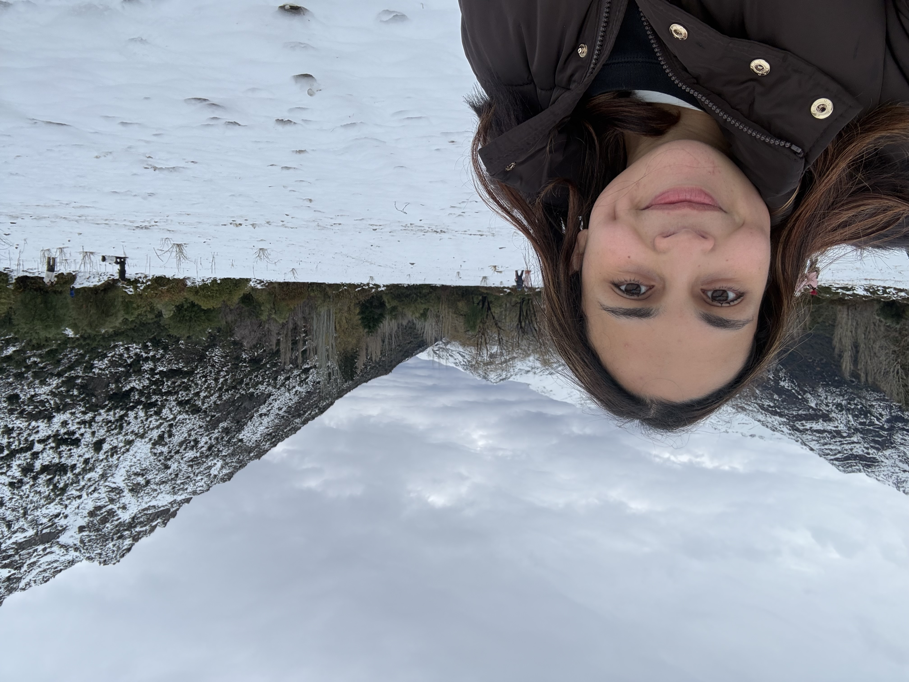
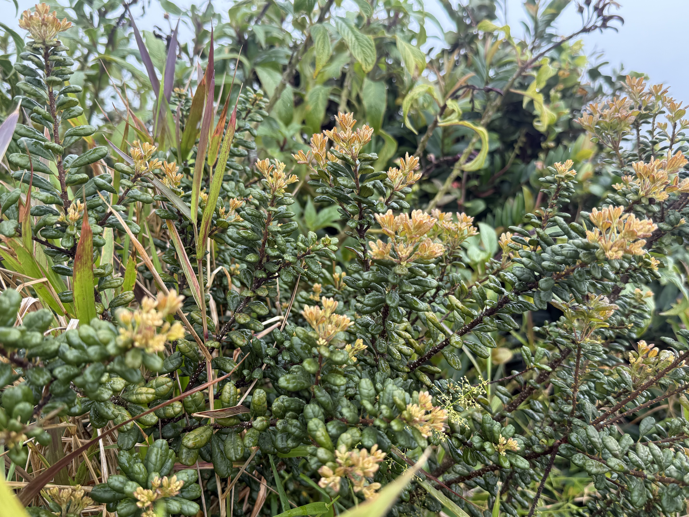

# Hey!
## About me!

- I am **Valeria** 
Happy to be here! 
I'm a **Biology Graduate student** with a concentration in **Botany** from the University of Puerto Rico. My thesis involves the study of the endemic plant *Morella holdridgeana*, a woody shrub belonging to the wax-myrtle family *Myricaceae*. My hobbies include reading, painting and finding the cutest coffee shops, and my favorite food is eggplant lasagna. **:) <3**

## Practicando para hacer una lista
+ Shopping list
  - Oranges
  - Apples 
  - Plantillas de harina 

## R tutorials: 

### [Homework 1](homeworks/Homework_1.html)

